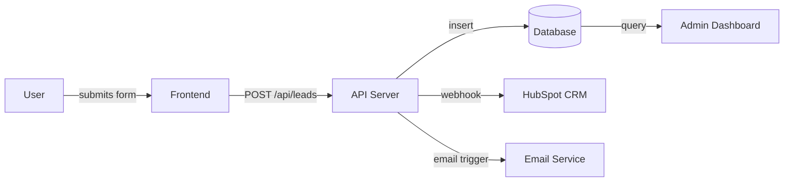
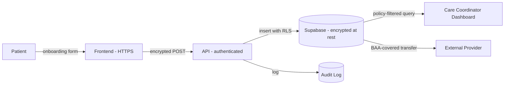

# Phase I: Integration

## Status
✅ **Complete**

## Purpose

Map every data flow, user journey, and third-party dependency before writing production code.

Phase I is the architecture phase that happens before you touch frameworks or databases. Teams that skip this phase build systems that are impossible to extend, violate compliance requirements they didn't know existed, and create data silos that require expensive re-architecture later.

**What you'll produce in Phase I:**
- A User Journey Map for each core workflow
- A Data Inventory (every piece of data you store, why, and who can access it)
- A Data Flow Diagram
- A Compliance Checklist (HIPAA, SOC 2, PCI-DSS, GDPR — whichever applies)
- A Third-Party Integration Map

---

## Core Workflow

### Step 1: Map User Journeys (Day 1–3)

A user journey map traces the path a user takes through your system from trigger to outcome. You need one per core workflow (typically 2–4 flows for an MVP).

**Journey Map Format:**

```
Trigger → Action → System Response → Outcome
```

**Full Journey Map Template:**

| Step | User Action | System Action | Data Created/Modified | Failure Mode |
|------|-------------|---------------|----------------------|--------------|
| 1 | [What user does] | [What system does] | [Data involved] | [What can go wrong] |
| 2 | ... | ... | ... | ... |

**Example — HubSpot Lead Flow (Martensen IP):**

| Step | User Action | System Action | Data Created | Failure Mode |
|------|-------------|---------------|--------------|--------------|
| 1 | Prospect fills contact form | HubSpot creates Contact record | Contact: name, email, phone | Form validation fails |
| 2 | Marketing reviews lead | System scores lead quality | Lead score, source attribution | Score misconfigured |
| 3 | Sales receives notification | HubSpot triggers follow-up task | Task: assigned, due date | Task not assigned |
| 4 | Attorney follows up | Email sent from HubSpot | Email: sent, opened, clicked | Deliverability issue |
| 5 | Lead converts | Contact → Deal created | Deal: value, stage, owner | Duplicate record |

---

### Step 2: Build a Data Inventory (Day 3–4)

Before choosing a database or writing a schema, enumerate every piece of data you will store. For each data element, answer:

| Field | Question |
|-------|----------|
| **Name** | What is this data called? |
| **Type** | PII? PHI? Financial? Behavioral? |
| **Source** | Where does it come from? |
| **Owner** | Which user/entity owns this data? |
| **Retention** | How long is it kept? |
| **Access** | Who can read/write/delete it? |
| **Compliance** | Does it trigger HIPAA, GDPR, PCI, SOC 2? |

**Claude Prompt — Data Inventory:**
```
I'm building [brief description]. Here are the user journeys we've mapped:

[paste journey maps]

For each journey, identify:
1. Every piece of data created, read, updated, or deleted
2. Whether any data is PII (personally identifiable information)
3. Whether any data is PHI (protected health information under HIPAA)
4. Whether any data triggers GDPR rights (EU users)
5. Whether any financial data triggers PCI-DSS
6. Recommended retention period for each data type
7. Who should have access to each data type
```

---

### Step 3: Draw Data Flow Diagrams (Day 4–5)

A data flow diagram (DFD) shows how data moves through your system. Use Mermaid.js for version-controlled diagrams.

**Basic DFD Template (Mermaid):**


**For each data flow, document:**
- Encryption in transit (HTTPS/TLS)
- Encryption at rest (AES-256 or equivalent)
- Authentication required (who can call this endpoint)
- Audit logging (is this action logged for compliance)

---

### Step 4: Identify Compliance Requirements (Day 5–6)

This is the step most teams skip and later regret. Determine which regulations apply to your project.

**Compliance Quick Reference:**

| Regulation | Triggers When | Key Requirements | Penalty |
|-----------|--------------|-----------------|---------|
| **HIPAA** | You handle medical/health data (US) | BAA required, PHI encryption, audit trails, access controls | $100–$50K per violation |
| **SOC 2** | Enterprise B2B customers require it | Security, availability, confidentiality controls | Loss of contracts |
| **PCI-DSS** | You process credit card payments | Card data isolation, no storage of CVV, encryption | Fines + loss of payment processing |
| **GDPR** | You have EU users | Consent, right to delete, data portability, DPA required | Up to 4% of global revenue |
| **CCPA** | You have California users with >$25M revenue or >100K records | Right to know, opt-out of sale, deletion rights | $7,500 per intentional violation |

**Decision rule:** If in doubt, assume the regulation applies and design for compliance. Retrofitting compliance is 10x more expensive than building it in.

---

### Step 5: Map Third-Party Integrations (Day 6–7)

Every third-party integration is a dependency, a potential data leak, and a compliance consideration.

**Integration Map Template:**

| Service | Purpose | Data Shared | Auth Method | Compliance Note | Failure Impact |
|---------|---------|-------------|-------------|-----------------|----------------|
| Stripe | Payments | Card token (not number), amount, user ID | API key (server-side only) | PCI-DSS: use Stripe.js, never touch raw card data | Hard block — no payments |
| SendGrid | Email | User email, name, email content | API key | GDPR: email consent required | Soft block — fallback possible |
| HubSpot | CRM | Lead data, contact info | OAuth | CCPA: subject to data sharing rules | Medium — manual workaround |

**Red flags to catch now:**
- Any integration that sends PII to a third party without a DPA (Data Processing Agreement)
- Any integration that stores credentials client-side
- Any webhook that doesn't validate signatures
- Any API that returns more data than needed (over-fetching)

---

### Step 6: Document the Integration Architecture (Day 7–8)

Produce a single architecture document that shows the complete system at a glance. This becomes the reference document for Phase S (Stack selection) and Phase T (Testing).

---

## Worked Examples

### Martensen IP (Law Firm — Professional Services)

**Core data flows:**
1. Lead capture → CRM → attorney assignment → follow-up sequence
2. Contact → Deal → Closed-Won/Lost → reporting
3. Email campaign → engagement tracking → lead scoring

**Compliance:**
- Attorney-client privilege: any communication stored must be access-controlled by attorney
- No HIPAA, no PCI (legal fees invoiced separately)
- State bar data retention requirements (7 years minimum for client records)

**Third-party integrations:** HubSpot (CRM), DocuSign (contracts), QuickBooks (invoicing), Gmail (email)

**Key finding from Phase I:** The firm's existing Salesforce instance had 5 years of unstructured contact notes that needed ETL (extract, transform, load) before HubSpot migration. This added 2 weeks to the project.

---

### Accolade (Healthcare — HIPAA)

**Core data flows:**
1. Patient onboarding → PHI collection → care coordinator assignment
2. Provider-to-provider data sharing → encrypted transfer → audit log entry
3. Patient handoff → context transfer → new coordinator access

**Compliance (CRITICAL for this project):**
- HIPAA applies to all patient data (PHI)
- Business Associate Agreement (BAA) required with every vendor that touches PHI
- Minimum necessary access: coordinators see only their assigned patients
- Audit trail: every PHI access must be logged with user, timestamp, action
- Encryption: PHI at rest (AES-256) and in transit (TLS 1.3)
- Right of access: patients can request their records within 30 days

**Data flow diagram:**


**Third-party integrations:** Only vendors with signed BAAs — Supabase (signed BAA available), Twilio (BAA available), no Google Analytics (HIPAA risk), no HubSpot without BAA.

**Key finding:** 12 integrations were initially proposed. Only 4 had signed BAA coverage. 8 required either vendor negotiation, replacement, or removal.

---

### Destwin (SaaS — SOC 2)

**Core data flows:**
1. Enterprise user login → auth → role-based access to booking tools
2. RFP creation → multi-vendor distribution → response aggregation → quote comparison
3. Booking confirmation → vendor notification → calendar sync → invoice generation

**Compliance (SOC 2 Type II path):**
- SOC 2 requires documented controls in 5 trust service criteria: Security, Availability, Processing Integrity, Confidentiality, Privacy
- Every data flow needs to map to one or more controls
- Change management log: every production change must be documented
- Access reviews: quarterly review of who has access to what
- Vendor risk management: third-party vendors assessed for security posture

**Key finding:** Phase I revealed that 3 workflows involved writing user data to vendor-side systems without user consent flows. These were redesigned before any code was written—saving an estimated 3 weeks of rework.

---

### RadioMall (eCommerce)

**Core data flows:**
1. Seller lists item → inventory record → search index → buyer discovery
2. Buyer searches → filter/sort → product page → cart → checkout → payment → confirmation
3. Streaming: user tunes in → stream URL → CDN delivery → engagement tracking

**Compliance:**
- PCI-DSS: payment card data never touches RadioMall servers (Stripe handles all card data)
- GDPR: European users require consent for tracking and marketing
- DMCA: streaming content requires licensing compliance

**Key integration finding:** The existing streaming platform and eCommerce platform had completely separate user databases. Phase I mapped the merge complexity—2,400 users needed deduplication logic before unification.

---

### Gardien Products (Manufacturing)

**Core data flows:**
1. Floor sensor/tablet → production event → real-time dashboard update → alert trigger
2. Shift data entry → daily production summary → automated weekly report
3. ERP (legacy) → batch sync → cloud database → analytics dashboard

**Compliance:**
- No HIPAA, no PCI
- Data retention: production records required for 5 years (regulatory)
- Network security: factory floor devices need network segmentation from corporate IT

**Key finding:** The on-premise ERP system (20+ years old) had no API. Phase I identified this early—the solution was a nightly CSV export + import pipeline rather than real-time sync, saving the project from a 12-week ERP integration detour.

---

## Decision Tree: Integration Complexity Scoring

Use this to assess project complexity before Phase S:

```
Score each integration: Low (1pt), Medium (2pt), High (3pt)

Factors:
├── Does it involve PII or PHI? → High
├── Is it a legacy system (5+ years, no modern API)? → High
├── Does it require a BAA or DPA? → Medium
├── Does it involve financial data or payments? → Medium
├── Is it a well-documented REST API? → Low
└── Is it your own new service? → Low

Scoring:
0–5:  Low complexity → standard timeline
6–10: Medium complexity → add 20% buffer to Phase D timeline
11+:  High complexity → consider phasing integrations across releases
```

---

## Claude Prompts for Phase I

### Prompt 1: Compliance Gap Analysis
```
Here is my application's data flow description:
[paste data flows]

Here are the types of users and data involved:
[paste data inventory]

Analyze this for compliance requirements:
1. Does this application trigger HIPAA? Why or why not?
2. Does this trigger PCI-DSS? What specific flows?
3. Does this trigger GDPR for EU users?
4. Does this trigger SOC 2 requirements for B2B enterprise?
5. For each regulation that applies, list the top 5 implementation requirements
6. Identify any data flows that appear risky even if not legally required to change
```

### Prompt 2: Third-Party Risk Review
```
Here are the third-party services in my application:
[paste integration list with data shared]

For each service:
1. What data are we sharing with them?
2. Is a BAA/DPA required? Does this vendor offer one?
3. What's the failure mode if this service goes down?
4. Are there any security or privacy concerns with this integration?
5. Recommend any alternatives if the risk is too high
```

---

## Phase Gate Checklist

Before moving to Phase S, confirm all of these:

- [ ] User journey maps documented for all core workflows (min. 2)
- [ ] Data inventory complete (every data type named, classified, and ownership assigned)
- [ ] Data flow diagrams created and reviewed
- [ ] Compliance requirements identified (HIPAA/PCI/GDPR/SOC2 — what applies, what doesn't)
- [ ] All third-party integrations listed with data-sharing scope
- [ ] BAAs/DPAs identified as required/not required for each vendor
- [ ] Failure modes documented for each critical integration
- [ ] Architecture overview document exists (can be simple diagram + bullets)
- [ ] No schemas or database tables have been created yet (that's Phase S)

---

## References

- [HIPAA Journal](https://www.hipaajournal.com) — practical HIPAA compliance guidance
- [SOC 2 Academy](https://www.vanta.com/resources/soc-2) — SOC 2 primer (Vanta)
- [GDPR.eu](https://gdpr.eu) — official GDPR guidance
- [PCI Security Standards](https://www.pcisecuritystandards.org) — PCI-DSS documentation
- [Mermaid.js](https://mermaid.js.org) — diagramming in markdown
- [Anthropic Claude API](https://docs.anthropic.com) — for AI Your BI℠ prompts

---

**Last updated:** April 2026  
**Owner:** INT Inc. + Community  
**Phase:** I of 8
